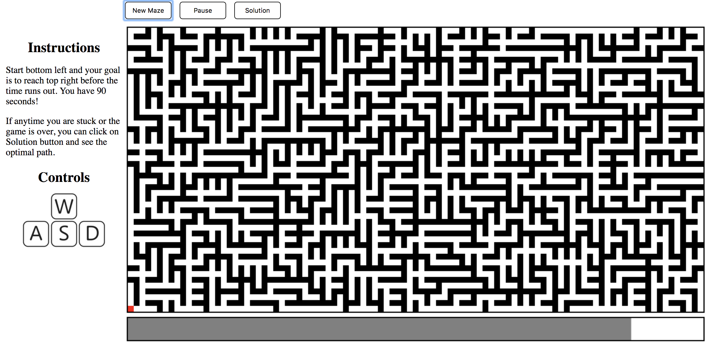
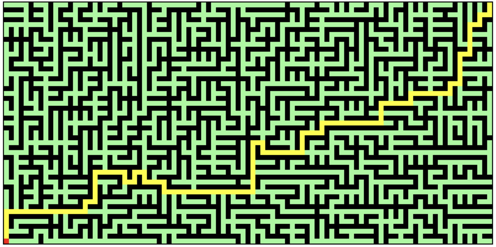

# Maze Solver

[Live Link](https://OnlyChobo.github.io/Amaze/)

### Background and Overview
Maze will be randomly generated. User will have a total of 90 seconds to navigate through the maze using WASD control. At any time, if the user decides to give up, they can press the solution button to see the optimal path.

### Architecture and Technologies
* JS
* CSS

### UI

### Maze Solver

BFS is used to solve the maze.

